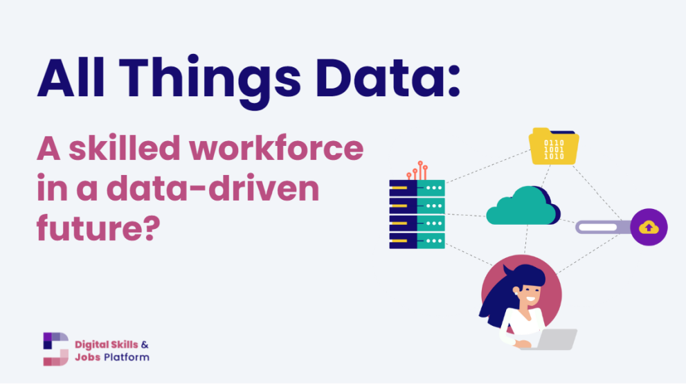

# Data-Driven Job Market Analytics Platform

### DSPT-12

**Project Date:** February 2026  

## Team Members
- Kigen Tuwei
- Kelvin Sesery
- Ray Onsongo 
- Kennedy Wamwati  
- Victor Wasunna

---

## Project Overview

The Job Market Intelligence System is designed to address the fragmented and opaque nature of today’s job market by transforming raw job posting data into actionable, real-time insights for job seekers, HR professionals, and educators. By analyzing English-language technical and professional job postings, the system identifies in-demand and declining skills, maps geographic hiring hotspots, benchmarks salaries by role and experience, and classifies emerging job trends. Its goal is to reduce information overload for job seekers, improve competitive hiring and compensation alignment for recruiters, and enable data-driven curriculum updates for educational institutions. Success will be measured through strong technical performance, such as over 80% job classification `accuracy` and salary prediction `MAE` below $15,000, alongside the delivery of clear, practical insights that support smarter career, hiring, and educational decisions. The Dataset used is [Download the dataset](https://www.kaggle.com/datasets/techsalerator/job-posting-data-in-kenya).

## 1. Business Problem

The modern job market operates in a fragmented and opaque environment where critical information about skill demand, compensation benchmarks, and geographic opportunities is scattered across thousands of job postings. This lack of centralized, data-driven insight creates inefficiencies for **job seekers** making career decisions, **HR professionals** competing for talent, and **educational institutions** attempting to align curricula with market needs. Without a unified intelligence system, stakeholders rely on incomplete or outdated information, leading to misaligned skills, uncompetitive salary offers, prolonged hiring cycles, and graduates entering the workforce unprepared for current demand. 

Some of the **business objectives** are;
- Develop a centralized Job Market Intelligence System that transforms raw job posting data into structured, actionable insights.
- Identify high-demand and declining technical skills to guide career development and curriculum updates.
- Map geographic hiring trends to highlight opportunity hotspots and regional demand shifts.
- Provide data-driven salary benchmarking by role, experience level, and location to improve compensation alignment.
- Classify job postings and detect emerging roles to support strategic workforce and educational planning.

---

## 2. Data Understanding
This project follows the **CRISP-DM (Cross Industry Standard Process for Data Mining)** framework to ensure a structured and rigorous data science workflow.

**Data Source:** 

The data was obtained from **Kaggle**, [The dataset](https://www.kaggle.com/datasets/techsalerator/job-posting-data-in-kenya). Techsalerator's Job Openings Data for Kenya provides a detailed and valuable overview of job opportunities across various sectors in Kenya. This dataset consolidates and categorizes job-related information from multiple sources, including company websites, job boards, and recruitment agencies, offering key insights into the Kenyan labor market.

**Dataset Overview:**

The dataset contains 9,919 job postings collected between February and September 2024, with 21 features describing job titles, descriptions, locations, seniority levels, contract types, salary information, and standardized occupational classifications. Most critical columns such as Job Opening Title (100%), Description (98.9%), Location (95.9%), and Seniority (100%) are highly complete, providing strong analytical reliability.

The dataset is predominantly text-based, making it highly suitable for:
- Skill extraction and demand analysis
- Job classification modeling
- Geographic opportunity mapping
- Market trend analysis

**Data Quality Assesment:**

The dataset demonstrates strong completeness in core descriptive fields and is well-suited for NLP-driven skill analysis and job market intelligence. Moderate preprocessing is required for JSON parsing, categorical normalization, and handling sparse salary data before advanced modeling.

Some of the data quality highlights are;
- `Ticker:` 100% missing, we removed it from analysis.
- `Category` 94% missing
- `Salary(JSON)` Structured but requires parsing
- `Location(JSON)` Requires parsing

**Data Cleaning:**

From our observaions, we noted that there were issues we needed to tackle so as to get the data ready for modelling. We decided to tackle the issues in this order;
- Drop completely empty columns
- Parse JSON columns (Location and Salary Data)
- Handle missing values
- Convert date columns
- Clean categorical/text data
- Create new features for the model

---

## 3. Exploratory Data Analysis

